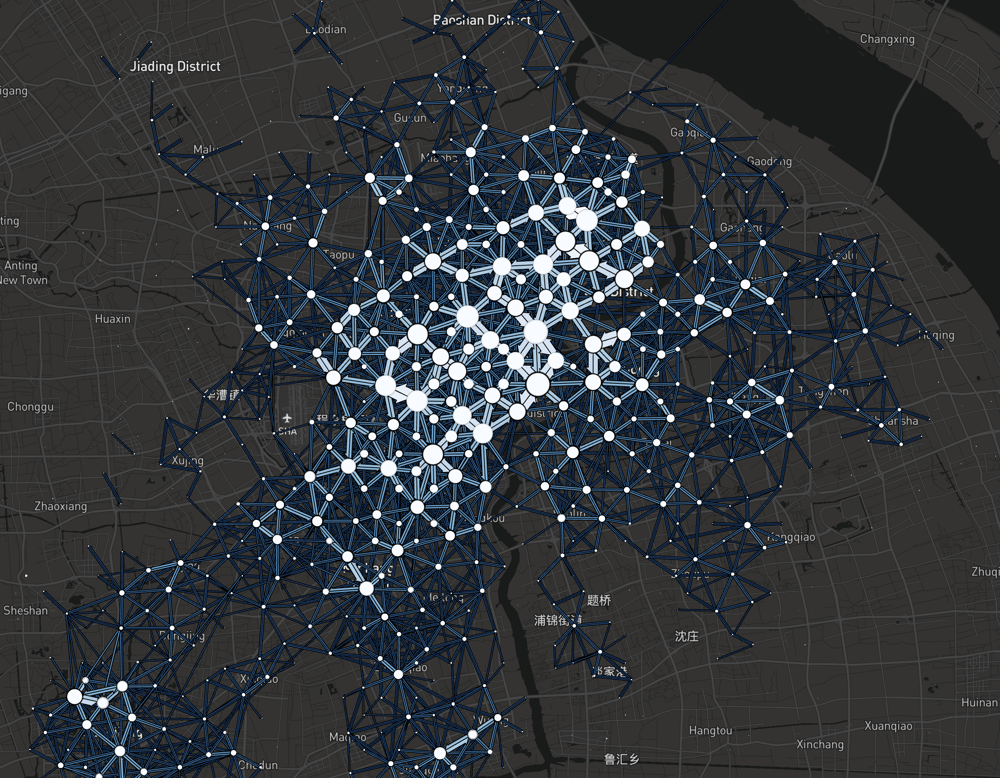

# ODview
ODview是一个OD数据可视化工具（由[Flowmap.gl](https://github.com/FlowmapBlue/flowmap.gl)提供支持)。 你可以导入自己的数据进行可视化，导入的数据应包含每个OD流的起点和终点位置的坐标。[点击此处访问](https://ni1o1.github.io/ODview/build/)

ODview is a visualization tool to visualize OD flow from your OD data (powered by [Flowmap.gl](https://github.com/FlowmapBlue/flowmap.gl)). Your data should contain the coordinates of start and end location of each OD flow. [Check this link](https://ni1o1.github.io/ODview/build/) to try ODview.

